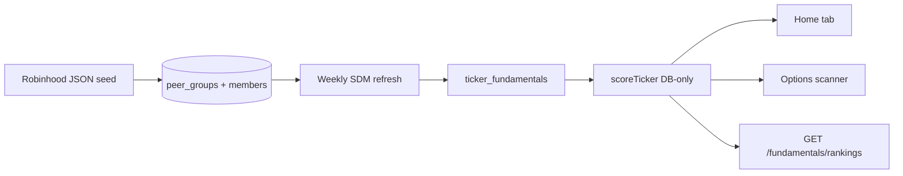
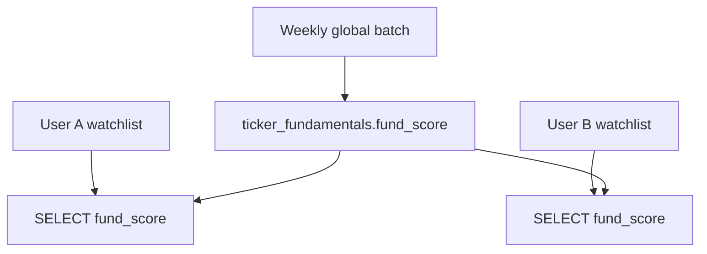

# Sector-Relative Fundamental Scoring — Implementation Plan

## Problem and outcome

**Today:** `[computeRankingsV2](artifacts/stock-compare/src/lib/rankings.ts)` sets `stockGroupKeys = "__global__"` — all loaded tickers normalized in one pool. `[home.tsx](artifacts/stock-compare/src/pages/home.tsx)` has a hardcoded preload list (`FUNDAMENTAL_WATCHLIST`) — a **bug workaround only**, not a design input. Scanner uses a different percentile scorer in `[fundamentals.ts](artifacts/api-server/src/routes/fundamentals.ts)`.

**After:** Each ticker scored vs **fixed `peer_group_members`** from Robinhood JSON (~558 tickers pre-mapped across 48 groups). User watchlist (any tickers, any count) does not define peers or scores. Cross-sector comparability via within-group z-scores → universal composite.

**What is NOT part of this design:** any specific user watchlist, the old 31-name preload list, or Robinhood's `your_tickers` fields in the JSON (portfolio overlap annotations only).




---

## Constraints (existing workflows)


| Rule                     | Implementation                                                                                                                                   |
| ------------------------ | ------------------------------------------------------------------------------------------------------------------------------------------------ |
| No API at score time     | Scorer reads `ticker_fundamentals` + `peer_group_members` only                                                                                   |
| 7-day stale fundamentals | Reuse `[StockDataManager](artifacts/api-server/src/lib/stock-data-manager.ts)` (`STALE_DAYS = 7`) — FactSet → FMP → Finnhub → EDGAR              |
| FMP budget 220/day       | Weekly peer refresh: stale-only, batch 5, respect `checkFMPBudget`; spread ~400 unique peers over multiple days                                  |
| Startup stale check      | `[index.ts](artifacts/api-server/src/index.ts)` today uses `WATCHLIST` — switch to `SELECT DISTINCT ticker FROM peer_group_members` (stale only) |
| No Redis                 | **Required:** pre-compute `fund_score` on weekly batch; rankings API reads column (see Multi-user section)                                       |
| Drizzle migrations       | New tables via `[lib/db](lib/db/src/schema/index.ts)` + `lib/db/drizzle/` migration; rebuild `@workspace/db`                                     |
| Minimal breakage         | Keep API response shape `{ ticker, totalScore }`; keep `StockScore` type; deprecate `computeRankingsV2` global path behind new function          |


**API call win:** Home loads scores from DB instead of preloading a hardcoded ticker list for normalization.

---

## Ticker mapping strategy (core design)

Robinhood `sector_taxonomy.json` contains **558 unique tickers** across **48 peer groups** (`all_tickers` arrays). This is the full pre-mapped universe — not a user watchlist subset.

```
Seed once:
  peer_group_members  ← all_tickers[] per group (558 rows, some tickers in multiple groups)
  ticker_registry     ← one row per unique ticker with primary_peer_group_id

At runtime (user adds any ticker):
  IF ticker IN ticker_registry → score vs its primary_peer_group_id peers (DB only)
  ELSE → classify (Task 0.5) → append to mapping file → score
```

**Why pre-map everything:** Most tickers users add (AAPL, NVDA, PLTR, etc.) are already in the 558. No special case for "original 31" — that list was legacy UI code.

**Dual membership:** A ticker may appear in multiple `peer_group_members` rows (e.g. NVDA in big_tech + semis). `primary_peer_group_id` on `ticker_registry` picks the scoring group (~20 curated primaries; all others default to their single group).

**Ignore entirely:** `your_tickers`, `missing`, `FUNDAMENTAL_WATCHLIST`, `WATCHLIST` in constants.ts — not seed inputs.

---

## Phase 0 — Config seed and tests (no UI changes)

### Task 0.1 — Seed script + canonical config

**Files:** new `scripts/seed-peer-groups.ts`, generated `artifacts/config/peer-groups.seed.json` (committed once, ~558 tickers)

**Merge logic:**

- `[sector_taxonomy.json](/Users/jamiepark/rbh_scripts/sector_taxonomy.json)` → `peer_group_id` = dot path (e.g. `technology.semiconductors_design`), members from `**all_tickers` only**
- `[fundamental_scoring_guide.json](/Users/jamiepark/rbh_scripts/fundamental_scoring_guide.json)` → `metric_profile` JSONB via guide ID map (32 scoring profiles mapped to taxonomy groups)
- For **every unique ticker** in union of all `all_tickers`: upsert `ticker_registry` with `primary_peer_group_id` (dual-membership table overrides default)
- Exclude ETFs: `SMH, SOXX, IWM, QQQ, SPY, BIZD, JBBB, NVDY, SPCX, PSUS`

**Taxonomy path → guide ID → scoring_mode**


| peer_group_id                                                 | Guide ID                                  | scoring_mode            |
| ------------------------------------------------------------- | ----------------------------------------- | ----------------------- |
| technology.big_tech_platforms                                 | 1_large_cap_tech_software                 | standard                |
| technology.enterprise_software_cloud                          | 2_midcap_growth_software                  | pre_revenue_ok          |
| technology.consumer_internet_digital_media                    | 3_consumer_internet_streaming_social      | standard                |
| technology.*ecommerce* / consumer_discretionary.*marketplace* | 4_consumer_internet_ecommerce_marketplace | standard                |
| technology.semiconductors_design                              | 5_semiconductors_design                   | standard                |
| technology.semiconductors_equipment_eda                       | 6_semiconductors_equipment_eda            | standard                |
| technology.chinese_tech                                       | 7_chinese_tech                            | chinese                 |
| technology.it_hardware_networking                             | 8_it_hardware_networking                  | standard                |
| fintech.digital_finance_payments                              | 9_payments_fintech                        | financial_mixed         |
| financials.large_banks                                        | 10_banks                                  | financial               |
| financials.asset_mgmt_alt_finance                             | 11_asset_mgmt_alt_finance                 | financial               |
| financials.insurance                                          | 12_insurance                              | insurance               |
| consumer_discretionary.restaurants_*                          | 13_restaurants                            | standard                |
| consumer_discretionary.retail_*                               | 14_retail                                 | standard                |
| consumer_discretionary.travel_*                               | 15_travel_leisure_hospitality             | standard                |
| consumer_discretionary.autos_evs                              | 16_autos_evs                              | standard                |
| consumer_staples.*                                            | 17_consumer_staples                       | standard                |
| healthcare.large_cap_biopharma                                | 18_large_cap_biopharma                    | standard                |
| healthcare.health_insurance_*                                 | 19_health_insurance_services              | healthcare_services     |
| healthcare.medical_devices_*                                  | 20_medical_devices_life_sciences          | standard                |
| industrials.aerospace_defense                                 | 21_aerospace_defense_industrials          | standard                |
| industrials.transportation                                    | 22_transportation                         | standard                |
| energy.oil_gas                                                | 23_energy_oil_gas                         | energy                  |
| energy.midstream                                              | 24_midstream_pipelines                    | energy                  |
| real_estate.reits                                             | 25_reits                                  | reit                    |
| utilities.*                                                   | 26_utilities                              | utility                 |
| materials.precious_metals_mining                              | 27_precious_metals_mining                 | mining                  |
| telecom.*                                                     | 28_telecom                                | standard                |
| energy.clean_energy                                           | 29_clean_energy_renewables                | speculative_ok          |
| speculative_thematic.space_aerospace_tech                     | 30_speculative_space_evtol                | speculative_pre_revenue |
| speculative_thematic.crypto_miners                            | 31_speculative_crypto_miners              | speculative_crypto      |
| healthcare.speculative_biotech                                | 32_speculative_biotech                    | speculative_pre_revenue |


**Dual membership primaries** (scoring uses primary only):


| Ticker | primary_peer_group_id                      | Also listed in           |
| ------ | ------------------------------------------ | ------------------------ |
| NVDA   | technology.semiconductors_design           | big_tech_platforms       |
| TSLA   | consumer_discretionary.autos_evs           | big_tech_platforms       |
| NFLX   | technology.consumer_internet_digital_media | big_tech_platforms       |
| SHOP   | consumer_discretionary.*ecommerce*         | consumer_internet        |
| AMZN   | technology.big_tech_platforms              | ecommerce (display only) |


All other tickers: `primary_peer_group_id` = their sole group, or first group if seed script finds only one membership.

### Task 0.5 — Unmapped ticker flow (outside the 558)

When a user adds a ticker **not** in the seed universe (e.g. a new IPO or obscure small-cap):

1. `GET /api/fundamentals/score/:ticker` → registry miss
2. **Auto-classify:** Yahoo `assetProfile` sector/industry → nearest `peer_group_id` via taxonomy keyword map (same infra as `peer-resolver.ts` profile fetch)
3. **Upsert** `ticker_registry.primary_peer_group_id` + append to `artifacts/config/ticker-mapping-overrides.json` (version-controlled additions)
4. Refresh fundamentals if stale (1 SDM call) → score → store `fund_score`
5. If no confident match: return `confidence: 'unmapped'`, neutral score 50, surface admin queue

This is rare once 558 are seeded — most user additions are already mapped.

### Task 0.2 — DB migration

Add to schema (`[lib/db/src/schema/index.ts](lib/db/src/schema/index.ts)`):

```sql
peer_groups (id TEXT PK, name, scoring_mode, metric_profile JSONB, benchmarks TEXT[])
peer_group_members (group_id, ticker, PRIMARY KEY)
ticker_registry.primary_peer_group_id TEXT FK
ticker_fundamentals: forward_pe, ev_ebitda, fund_score, cross_sector_score, fund_scored_at, fund_score_confidence
```

Run Drizzle migration + rebuild `lib/db`.

### Task 0.3 — Unit tests (fixture-first)

**File:** `lib/scoring/src/fundamental-scorer.test.ts` (new shared package)

Pure functions: `normalizeWithinGroup()`, `compositeCrossSector()`, `scoreTicker(rows, profile, subjectTicker)`.

**Golden test cases:**


| Test              | Input                                       | Assert                                                   |
| ----------------- | ------------------------------------------- | -------------------------------------------------------- |
| Shelf invariance  | Score NVDA with peer rows [AMD,INTC,AVGO,…] | Same score whether "shelf" is [NVDA] or [NVDA,AAPL,BABA] |
| BABA sector       | BABA + chinese_tech peers (PDD,JD,BIDU,…)   | BABA rank mid-pack; NOT top-quartile vs US mega-caps     |
| Global regression | Old `__global`__ vs new on mixed set        | NVDA/BABA/SOFI ranks **change** (proves fix works)       |
| Low confidence    | Group with 3 peers with data                | `confidence: 'low'`, no fabricated z-score               |
| SaaS no P/E       | PLTR in enterprise_software group           | P/E excluded; EV/Revenue or P/S used per profile         |
| Banks             | JPM in large_banks                          | EV/EBITDA excluded per financial mode                    |


**Example (shelf invariance):**

```
Peers: NVDA fwd_pe=35, AMD=28, INTC=22, AVGO=25, QCOM=20, MRVL=30, MU=18, ARM=40
scoreTicker("NVDA", peers) === 62.4  // same when shelf = ["NVDA"] or ["NVDA","AAPL","BABA"]
```

---

## Phase 1 — Scorer + API (server-side, DB-only)

### Task 1.1 — Extract `lib/scoring` package

Move core logic from `[rankings.ts](artifacts/stock-compare/src/lib/rankings.ts)` + `[rankings-helpers.ts](artifacts/stock-compare/src/lib/rankings-helpers.ts)`:

- Reuse `normalize()` — align winsorize to **2nd/98th** for groups with n≥10; `MIN_PEERS=5` (Robinhood), wire existing `MIN_SECTOR_N=6` for `low_confidence` flag
- **Layer 1:** within-group z-scores on group `metric_profile.include` minus exclusions
- **Layer 2:** cross-sector composite on 8 universal z-scores (weights from Robinhood Appendix A in [v1 plan](.cursor/context/plans/fundamental-sector-scoring-v1.md))
- **Layer 3:** blend `0.7 * cross_sector + 0.3 * putSellerFloor` using existing `SCORECARD_METRICS_V2` / PUT_SELLER families
- Unify ROIC/WACC: always `approxWACC()` at score time (fix API route using empty DB `wacc`)

**Export:** `scoreFundamental(ticker: string, peerRows: FundRow[], profile: MetricProfile): FundScoreResult`

### Task 1.2 — DB loader + API

**File:** `artifacts/api-server/src/lib/fundamental-scorer-service.ts`

```typescript
async function scoreFundamentalFromDb(ticker: string): Promise<FundScoreResult> {
  const groupId = registry.primary_peer_group_id;
  const peers = await db.select members + fundamentals for groupId;
  return scoreFundamental(ticker, peers, profile); // no fetch
}
```

**Endpoints:**

- `GET /api/fundamentals/rankings` — replace inline percentile logic; score all tickers in `ticker_registry` (or requested tickers) from DB
- `GET /api/fundamentals/score/:ticker` — single ticker (for Home compare view)

Response keeps `{ ticker, totalScore }` + optional `{ confidence, peerGroupId, flags }` for UI.

### Task 1.3 — Weekly peer refresh job

**File:** extend `[stock-data-manager.ts](artifacts/api-server/src/lib/stock-data-manager.ts)` or new `peer-universe-refresh.ts`

```
tickers = SELECT DISTINCT ticker FROM peer_group_members WHERE ticker NOT IN etf_exclude
FOR t IN tickers WHERE fundamentals stale (>7d):
  stockDataManager.getFundamentals(t)  // respects source budgets
REQUIRED: batch scoreFundamental → UPDATE fund_score, cross_sector_score, fund_scored_at
```

Wire startup in `[index.ts](artifacts/api-server/src/index.ts)`: replace `getStaleTickers(WATCHLIST)` with peer-universe stale query. Cap daily refresh to FMP budget remainder (~30 tickers/day at 7 calls each within 220 FMP budget).

Update `[fundamentals.ts](artifacts/api-server/src/routes/fundamentals.ts)` `POST /fundamentals/refresh` to refresh peer universe (not `WATCHLIST` from `[constants.js](artifacts/api-server/src/lib/constants.js)`).

### Task 1.4 — Pre-computed scores (required for scale)

Scores are **per-ticker, not per-user**. All 20 users reading NVDA get the same `fund_score` from `ticker_fundamentals`.

```
Weekly batch: FOR each ticker in peer_group_members → score → UPDATE fund_score
Runtime:      GET /fundamentals/score/:ticker → SELECT fund_score FROM ticker_fundamentals (no re-score)
              GET /fundamentals/rankings      → SELECT fund_score WHERE ticker IN registry (no re-score)
```

On-demand re-score only when: (a) admin force-refresh, or (b) `fund_scored_at` older than fundamentals refresh.

### Task 1.5 — scoring_mode metric switching

`scoring_mode` on `peer_groups` selects which metrics run in **all layers**:


| scoring_mode            | Layer 1 metrics                                             | Layer 2 universal                     | Layer 3 PUT_SELLER             |
| ----------------------- | ----------------------------------------------------------- | ------------------------------------- | ------------------------------ |
| standard                | group primary_metrics minus exclusions                      | all 8 universal z-scores              | full families                  |
| pre_revenue_ok          | EV/Revenue, P/S, growth, margins — **no P/E, no PEG**       | skip forward_pe if null               | **exclude earningsYield, peg** |
| financial               | P/B, ROE, D/E, dividend — **no EV/EBITDA, no gross margin** | skip ev_ebitda, profit_margin if N/A  | exclude margin metrics         |
| reit                    | P/FFO proxy, yield, D/E — **no P/E**                        | skip forward_pe                       | exclude earningsYield          |
| speculative_pre_revenue | cash runway, burn, P/S only                                 | cash metrics only; flag `pre_revenue` | safety family only             |
| chinese                 | standard minus ROE if VIE-distorted                         | same with ROE caveat                  | standard with flags            |


Robinhood `excluded_metrics` strings in `metric_profile` JSONB drive the skip list — parsed at seed time into machine-readable keys.

---

## Multi-user scalability (20 users, different watchlists)

**Will the app break? No — if pre-compute is implemented.** User watchlists do not affect scoring or peer refresh scope.


| Action                 | Per user?       | External API calls             | DB reads                                       |
| ---------------------- | --------------- | ------------------------------ | ---------------------------------------------- |
| Load Home (5 tickers)  | yes             | 5 quote fetches (display only) | 5 `SELECT fund_score`                          |
| Load Options scanner   | yes             | options chains (existing)      | 1 `SELECT fund_score` for all registry tickers |
| Score NVDA             | **no — shared** | **0**                          | 1 row read                                     |
| Weekly peer refresh    | **no — global** | stale peers only (~30/day cap) | batch upsert                                   |
| User adds new ticker X | once per ticker | 1 SDM refresh if X stale       | upsert X + score X                             |


**20 users × different watchlists:** Each user fetches quotes for their own shelf (unchanged). Fundamental scores are identical across users for the same ticker — pulled from `ticker_fundamentals.fund_score`. No multiplication of FMP/FactSet calls by user count.

**What would break without pre-compute:** If `GET /fundamentals/rankings` re-runs z-scores across full peer panels on every request, 20 concurrent scanner loads = 20× CPU + heavy DB joins. Fix: read pre-computed column.

**User-specific ticker not in peer universe:** On first add, lookup/assign `primary_peer_group_id`, refresh fundamentals if stale (1 SDM call), score once, store `fund_score`. Other users benefit immediately.




---

## Seed and backfill (not Robinhood MCP)

**No Robinhood MCP server** — seed uses static JSON files already on disk:

- `/Users/jamiepark/rbh_scripts/sector_taxonomy.json` → peer members
- `/Users/jamiepark/rbh_scripts/fundamental_scoring_guide.json` → metric profiles

**Two-step bootstrap:**

1. **Migration + seed (instant, no API):** `scripts/seed-peer-groups.ts` writes `peer_groups`, `peer_group_members`, `ticker_registry.primary_peer_group_id`. Committed `artifacts/config/peer-groups.seed.json` for reproducibility.
2. **Fundamentals backfill (batched, days/weeks):** `scripts/backfill-peer-fundamentals.ts` (admin-only)
  - `SELECT DISTINCT ticker FROM peer_group_members` (~558 unique)
  - Process stale-only via `StockDataManager.getFundamentals()` in batches of 5
  - Respect FMP 220/day + FactSet 20/sec — expect **~2 weeks** for initial full universe at budget caps
  - After each batch: run scorer → write `fund_score`
  - `GET /api/fundamentals/status` tracks coverage %

New ticker added by any user: piggybacks on same SDM path — not a separate backfill.

---

## Metric coverage — what we include vs Robinhood (~40% gap)

**v1 includes (fetchable today):**


| Layer                    | Metrics                                                                                  | Source                                 |
| ------------------------ | ---------------------------------------------------------------------------------------- | -------------------------------------- |
| Universal composite (8)  | forward_pe, ev_ebitda, fcf_yield, roe, revenue_growth, profit_margin, de, dividend_yield | FMP + FactSet + derived                |
| PUT_SELLER families (17) | earningsYield, fcfYield, peg, margins, roicWacc, cashRunway, etc.                        | existing pipeline                      |
| Sector exclusions        | skip inapplicable metrics per `scoring_mode`                                             | seed from Robinhood `excluded_metrics` |


**NOT in v1 (~40% of Robinhood primary_metrics — Tier 2/3):**


| Category          | Examples                         | Why deferred                                      |
| ----------------- | -------------------------------- | ------------------------------------------------- |
| SaaS engagement   | NRR, Rule of 40, net retention   | Not in FMP stable; earnings/manual                |
| Consumer internet | MAU, DAU, ARPU, watch hours      | Not in standard APIs                              |
| Banks             | CET1, NIM, efficiency ratio, NPL | FMP bank ratios partial; need specialty endpoints |
| Insurance         | combined ratio, premium growth   | Specialty                                         |
| REITs             | P/FFO, occupancy, NAV premium    | P/FFO approximatable; others manual               |
| Energy            | reserve replacement, AISC        | Manual/quarterly                                  |
| Crypto miners     | hash rate, cost/BTC              | Specialty                                         |
| Biotech/space     | pipeline stage, cash burn months | Manual flags                                      |


**Honest v1 coverage:** Sector-relative scoring on **~60% of Robinhood's metric intent** using universal + existing V2 metrics with correct exclusions. The big win is **correct peer pool + exclusions**, not full metric parity.

**UI:** Show `metrics_available: 8/14` per group so users know score is partial.

---

## Sector methodology — does the plan handle it?

**Yes, partially — with gaps to close in Task 1.5:**


| Robinhood rule                       | Plan handling                                                 |
| ------------------------------------ | ------------------------------------------------------------- |
| Pre-revenue SaaS: no P/E             | `pre_revenue_ok` mode excludes P/E, PEG; uses EV/Revenue, P/S |
| Banks: no EV/EBITDA, no gross margin | `financial` mode skips those in all layers                    |
| REITs: no P/E, use P/FFO             | `reit` mode; P/FFO proxy from FMP if available else flag      |
| Chinese ADR: vs Chinese peers only   | `chinese` peer group isolation                                |
| Speculative: cash runway only        | `speculative_pre_revenue` mode — safety metrics + flag        |
| Negative earnings: exclude P/E       | Robinhood rule in Layer 1; use EV/Revenue                     |


**Known gap (deficiency):** Layer 3 PUT_SELLER still includes `earningsYield` and `peg` globally unless Task 1.5 explicitly applies same exclusions — pre-revenue names could still be penalized in the 30% quality floor blend. Fix: quality floor uses **group-filtered metric subset only**.

---

## Plan deficiencies (honest audit)


| Deficiency                                                           | Severity | Mitigation                                                      |
| -------------------------------------------------------------------- | -------- | --------------------------------------------------------------- |
| Layer 3 PUT_SELLER may conflict with sector exclusions               | High     | Task 1.5 — filter families by scoring_mode                      |
| ~40% Robinhood metrics not in v1                                     | Medium   | Tier 2 roadmap; UI coverage indicator                           |
| Initial backfill takes ~2 weeks at FMP budget                        | Medium   | Ship with partial coverage; `low_confidence` + status dashboard |
| `GET /fundamentals/rankings` scoring all registry vs peer universe   | Low      | Pre-compute; rankings = simple SELECT                           |
| Taxonomy ↔ guide ID mapping has fuzzy rows (`*ecommerce`*)           | Medium   | Seed script validation report; manual fix list                  |
| speculative_small_cap may have <5 peers with data                    | Medium   | `low_confidence` flag; Robinhood suggests flag as unscored      |
| Competitors UI still uses dynamic `peer-resolver`, not sector groups | Low      | Out of v1; document as separate feature                         |
| Chinese ADR data quality (VIE, FactSet coverage)                     | Medium   | `chinese` flags; triangulation already exists                   |
| No per-user watchlist in DB yet (future user-mgmt)                   | Low      | Scores already user-agnostic — ready for multi-user             |
| Compare view ranks 2–5 tickers cross-sector                          | Low      | Show absolute fund_score, not ordinal rank within 5             |
| V3 self-history deferred                                             | Low      | Phase 4                                                         |
| Robinhood `typical_range`/`median` unused                            | None     | Reference/UI tooltips only (correct)                            |
| Two refresh paths (fundamentals.ts FMP-only vs StockDataManager)     | Medium   | Consolidate on StockDataManager in Task 1.3                     |


---

## Phase 2 — Wire consumers + remove legacy hacks

### Task 2.1 — Home tab

`[home.tsx](artifacts/stock-compare/src/pages/home.tsx)`:

- **Delete** `FUNDAMENTAL_WATCHLIST` + `watchlistQueries` (legacy preload hack — unrelated to peer universe)
- Fetch scores via `GET /api/fundamentals/score/:ticker` per displayed shelf ticker (or batch)
- Compare view (2–5 tickers): show each ticker's **sector-relative** score, not rank within the 5

### Task 2.2 — Options scanner

`[options-scanner.tsx](artifacts/stock-compare/src/pages/options-scanner.tsx)` already uses `GET /api/fundamentals/rankings` with `staleTime: Infinity` — no client change once API is unified.

### Task 2.3 — Deprecate duplicates

- Remove percentile logic from `[fundamentals.ts](artifacts/api-server/src/routes/fundamentals.ts)` rankings route
- Refactor `[peer-rankings.ts](artifacts/api-server/src/lib/peer-rankings.ts)` `computeFundScoresForRows` to call shared scorer (for future Competitors wiring)
- Leave `computeRankingsV2` as thin wrapper calling shared scorer for any remaining client paths; remove `__global`__ branch

### Task 2.4 — Scorecard Guide UI

Update `[scorecard-guide-metadata.ts](artifacts/stock-compare/src/lib/scorecard-guide-metadata.ts)`: document sector-relative methodology, peer group name, confidence flags.

---

## Phase 3 — Tier 1 metrics (pipeline)

### Task 3.1 — Add `forward_pe`, `ev_ebitda` to pipeline

- Extend `[FMPFundamentalsData](artifacts/api-server/src/lib/fmp-client.ts)` + `upsertFundamentals` in StockDataManager
- FMP: `key-metrics` / `ratios` endpoints; Yahoo `forwardPE` fallback already in `[stocks.ts](artifacts/api-server/src/routes/stocks.ts)` line 238
- DB columns on `ticker_fundamentals`
- Map into universal composite (Layer 2)

Backfill peer universe via existing admin refresh; no new fetch pattern.

---

## Phase 4 — Later (out of v1 scope)

- `computeRankingsV3` self-history (only after Layer 1–2 stable)
- Tier 2 sector KPIs (NRR, P/FFO, combined ratio, CET1, combined ratio)
- Competitors tab wired to sector peer groups (not dynamic Finnhub peers)

---

## Why scores improve (measurable)


| Before                                             | After                                           |
| -------------------------------------------------- | ----------------------------------------------- |
| BABA ranked vs AAPL/NVDA on raw P/E                | BABA vs PDD/JD/BIDU on sector-adjusted z-scores |
| PLTR penalized on meaningless global P/E           | EV/Revenue vs SaaS peers only                   |
| Score changes when user adds/removes shelf tickers | Invariant — peers from DB                       |
| Scanner ≠ Home (percentile vs z-score)             | Single scorer, same number everywhere           |
| Hardcoded preload list on Home load                | 0 — scores from DB per shelf ticker             |


---

## Rollout / breakage prevention

1. **Phase 0** ships migration + seed + tests — zero runtime behavior change
2. **Phase 1** ships new API behind same route; compare old vs new in tests
3. **Phase 2** switches Home; monitor one release with `fund_score_confidence` visible in UI
4. Keep `computeRankings` V1 untouched (legacy 2-ticker compare if still used)
5. Technical scorer (`[technical-rankings.ts](artifacts/stock-compare/src/lib/technical-rankings.ts)`) — **do not change**; combined weights in `[stock-scorer.ts](artifacts/stock-compare/src/lib/stock-scorer.ts)` unchanged (fund still 25%)

---

## Validation checklist (ship gate)

- [ ] NVDA score identical whether user shelf has 1 ticker or 50 unrelated tickers
- [ ] Ticker in seed universe (e.g. CRM) scores immediately with no manual mapping
- [ ] Ticker outside seed universe triggers auto-classify or `unmapped` flag, not global pool
- [ ] BABA not top-quartile vs Chinese peer panel
- [ ] Home `totalScore` === scanner `totalScore` for same ticker
- [ ] `low_confidence` when n_peers < 5
- [ ] No external API calls in scorer code path (grep / integration test)
- [ ] Peer refresh respects 7-day stale + FMP 220/day cap
- [ ] 20 concurrent users reading same ticker → 0 additional FMP calls; same `fund_score`
- [ ] PLTR/IONQ: P/E and earningsYield excluded in pre_revenue_ok mode
- [ ] `verifier`: tsc + lint + new unit tests pass

---

# APPENDIX I — Current production scoring (2026-06-24)

> **Purpose:** Accurate baseline for any AI model implementing sector-relative scoring. Describes **what the code does today**, not the target state. Source of truth is TypeScript — not `.md` docs (several are stale; see bottom).

## Source-of-truth file map

| Layer | Authoritative code | UI / consumer |
|---|---|---|
| Fundamental V2 | `artifacts/stock-compare/src/lib/rankings.ts`, `rankings-helpers.ts` | `home.tsx` → `computeRankingsV2` |
| Fundamental API (duplicate) | `artifacts/api-server/src/routes/fundamentals.ts` L151–224 | `options-scanner.tsx` → `GET /api/fundamentals/rankings` |
| Fundamental V3 (unwired) | `rankings.ts` → `computeRankingsV3` | Never called |
| Technical V2 | `artifacts/stock-compare/src/lib/technical-rankings.ts` | `technical.tsx`, `options-scanner.tsx` |
| Technical API mirror | `artifacts/api-server/src/lib/technical-scorer-v2.ts` | Server-side row scoring (Competitors path) |
| Combined stock score | `artifacts/stock-compare/src/lib/stock-scorer.ts` | Options scanner stock layer |
| Strike option score | `artifacts/stock-compare/src/lib/option-scorer.ts`, `option-scorer-constants.ts` | Options scanner strike cards |
| Human-readable metric catalog | `scorecard-guide-metadata.ts` (imports live constants) | `/scorecard-explanation` |
| Fundamental data | `artifacts/api-server/src/lib/stock-data-manager.ts` | DB `ticker_fundamentals`, 7-day stale |
| Technical data | `artifacts/api-server/src/routes/technicals.ts` + refresh job | DB `ticker_technicals`, ~daily stale |

---

## Fundamental scoring — V2 (`computeRankingsV2`)

### Where it runs

- **Home tab** (`home.tsx`): client-side on `StockMetrics[]` from per-ticker quote queries.
- Pool for normalization: all tickers passed in — effectively **`__global__`** (every stock gets the same group key). Comment in code: sector-neutral mode not wired.
- **Legacy stability hack:** `FUNDAMENTAL_WATCHLIST` — hardcoded preload of ~31 tickers so z-score pool size does not jump when user adds/removes shelf tickers. This is **not** a peer universe; delete on sector-relative ship.

### Data sources

| Field | Primary source | Notes |
|---|---|---|
| Revenue, EBITDA, margins, ROE, FCF, D/E, growth | FactSet Overview (Oracle proxy) | ~57% field coverage |
| PE, P/B, P/S, ROIC, Beta, WACC, shares, interest | FMP | Fills FactSet gaps |
| Quote price, marketCap (for yields) | Yahoo quote | Live on Home via `getStockQuote` |
| Storage | PostgreSQL `ticker_fundamentals` | 7-day freshness via `StockDataManager` |

Home scoring uses **live quote `StockMetrics`** (merged Yahoo + DB fundamentals), not a direct DB read at score time.

### Metrics (17) — `SCORECARD_METRICS_V2`

Intra-weights are **relative within family**; renormalized over non-null metrics only.

**Value family (PUT_SELLER weight 20%):**

| Key | Label | IntraWt | Direction | Raw source |
|---|---|---:|---|---|
| earningsYield | Earnings Yield | 3 | higher | netIncome / marketCap |
| fcfYield | FCF Yield | 3 | higher | freeCashFlow / marketCap |
| peg | PEG Ratio | 2 | lower | pegRatio; **null** if epsGrowth ≤ 0 or netIncome < 0 |

**Growth family (25%):**

| Key | IntraWt | Direction | Raw source |
|---|---:|---|---|
| revgrow | 3 | higher | revenueGrowthYoY |
| epsgrow | 3 | higher | epsGrowth |
| upside | 1 | higher | (analystTarget / currentPrice) − 1 |

**Quality family (35%):**

| Key | IntraWt | Direction | Notes |
|---|---:|---|---|
| grossmgn | 2 | higher | grossMargin |
| operatingmgn | 2 | higher | operatingMargin |
| netmgn | 3 | higher | netIncome/totalRevenue or netMargin |
| roe | 2 | higher | returnOnEquity |
| fcfmgn | 2 | higher | freeCashFlow / totalRevenue |
| roicwacc | 1.5 | higher | roic − approxWACC(); **null** for HOOD, SOFI |

**Safety family (20%):**

| Key | IntraWt | Direction | Notes |
|---|---:|---|---|
| cashrun | 3 | higher | cash / quarterly burn; capped at 20q if cash-generative |
| intcov | 2.5 | higher | ebit / interestExpense |
| dilution | 2 | lower | shares growth rate |
| cr | 1.5 | higher | currentRatio |
| de | 1 | lower | debtToEquity |

**Family presets** (`FAMILY_PRESETS`): default **PUT_SELLER** = value 20, growth 25, quality 35, safety 20 (sums to 100). Alternate GROWTH preset exists but Home uses PUT_SELLER via `ScoringPreferencesContext`.

### Normalization algorithm (`rankings-helpers.normalize`)

Applied **per metric across the entire loaded pool** (global cross-section):

1. Collect non-null finite values for metric M across all tickers in pool.
2. If **n ≥ 8** (`MIN_Z_N`): winsorize at **5th/95th** percentile → z-score → clip ±3σ → map to [0,1] via `(z+3)/6`; invert if lower-is-better.
3. If **n < 8**: ordinal rank (best=1.0, worst=0.0, singleton=1.0).
4. `MIN_SECTOR_N = 6` is defined but **unused**.

### Post-normalization guards

- **Suspect flags:** |netMargin| > 100%, |revgrow| > 1000%, |epsgrow| > 1000%; |netIncome| > |totalRevenue| flags earningsYield + netmgn.
- **Tiny-revenue growth cap:** if totalRevenue < $100M and revgrow > 500% → revgrow score forced to neutral 0.5.
- **Missing data:** null metric excluded from family; family with zero metrics → neutral 0.5; `dataQuality` from family coverage (good ≥75%, partial ≥40%).

### Final fundamental score (Home)

```
familyScore[f] = Σ (normScore[m] × intraWeight[m]) / Σ intraWeight[available m]
totalScore      = Σ familyScore[f] × FAMILY_PRESETS.PUT_SELLER[f]   → 0–100
```

Output type: `StockScore` — totalScore, rank (within loaded pool), metricScores, familyScores, suspectMetrics, waccInputs.

### Fundamental V3 (`computeRankingsV3`) — exists, not wired

- Same global `__global__` peer fallback.
- Adds **self-history** percentile from `ticker_fundamentals_history` where available; falls back to peer normalize.
- **Never called** in production UI or API.

---

## Fundamental scoring — API duplicate (`GET /api/fundamentals/rankings`)

**Used by:** Options scanner only (`fundRankingsData`, `staleTime: Infinity`).

**Different from Home V2:**

| Aspect | Home V2 | API rankings |
|---|---|---|
| Input | Live `StockMetrics` quotes | DB `ticker_fundamentals` rows only |
| Normalization | Winsorized z-score (n≥8) or ordinal | **Percentile rank** across all DB rows |
| Metrics | 17 across 4 families | **11** — no value family (no earningsYield, fcfYield, peg, upside) |
| ROIC−WACC | approxWACC() at score time | DB `wacc` column (often empty → null) |
| Pool | Loaded/preloaded tickers | All rows in `ticker_fundamentals` |

**API metrics (flat weighted sum, not family structure):**

| Metric | Weight | Direction |
|---|---:|---|
| grossMargin | 2.0 | higher |
| operatingMargin | 2.0 | higher |
| netMargin | 3.0 | higher |
| roe | 2.0 | higher |
| roicWacc | 1.5 | higher (roic − wacc from DB) |
| revGrowth | 3.0 | higher |
| epsGrowth | 3.0 | higher |
| currentRatio | 1.5 | higher |
| debtToEquity | 1.0 | lower |
| intCoverage | 2.5 | higher |
| cashRunway | 3.0 | higher |

```
totalScore = (Σ pctRank[m] × weight[m]) / Σ weight[available] × 100   // default 50 if no data
```

**Result:** Same ticker can show **different fundamental scores** on Home vs Options scanner.

**Dead code:** `peer-rankings.ts` → `computeFundScoresForRows` duplicates API percentile logic; `rankCompetitors()` has zero callers.

---

## Technical scoring — V2 (`computeTechnicalRankingsV2`)

### Where it runs

- **Technical tab** (`technical.tsx`)
- **Options scanner** (`options-scanner.tsx`) — tech component of stock score

### Data sources

```
Yahoo chart 420d OHLCV → daily batch compute → ticker_technicals (55 cols)
→ GET /api/technicals/all → client scorer
```

Refresh: ~daily (`STALE_HOURS = 23` on server). **No live Yahoo in UI.**

### Self-relative design (critical)

Each ticker's score depends **only on its own DB row**. Cross-ticker sorting assigns display rank but **does not affect** any score value. Comment at L335–336 in `technical-rankings.ts`.

Stored self-relative fields include: `rsi14Pct`, `mfi14Pct`, `stochPct`, `ivRank`, `bbWidthPct`, `volumeRatioPct`, `priceZScore`, `priceVsMa50Atr`, etc.

### Components — `TECHNICAL_SCORECARD_METRICS_V2`

| Component | Weight | Score logic (each → [0,1], null excluded) |
|---|---:|---|
| oversoldDepth | 25% | mean(1−rsi14Pct, 1−mfi14Pct, 1−stochPct) |
| reversalSignal | 20% | MACD UP=1/FLAT=0.5/DOWN=0; RSI velocity sigmoid; support distance |
| volatilityState | 22% | ivRank; IV/realized spread; 1−bbWidthPct (squeeze) |
| trendContext | 18% | regime BULLISH=1/NEUTRAL=0.5/BEARISH=0.3; −priceVsMa50Atr/3; VWAP distance |
| optionsFlow | 10% | put/call ratio, skew, IV term — **absolute mapping** (not percentile yet) |
| volumeConfirm | 5% | volumeRatioPct from DB |

```
totalScore = (Σ compScore × weight) / (Σ available weights) × 100   → 0–100
```

### GO / WATCH / NO gate (separate from totalScore)

- **GO:** rsi14Pct < 0.30 AND (mfi14Pct < 0.35 OR stochPct < 0.35) AND (MACD UP OR rsiVelocity > 0) AND NOT fallingKnife AND earnings > 7d out
- **WATCH:** approaching conditions, or GO blocked by knife/earnings
- **NO:** otherwise
- `regime=BEARISH` affects trendContext component only — **never blocks** gate alone
- Coverage < 50% → gate NO

### Known V2 limitations (documented in code)

- `ivRank` / `ivPercentile`: realized-vol proxy until ~60d `atmPutIv` history accumulates
- `putCallVolumeRatio` / `basicSkew`: absolute mapping until ~60d history for percentiles

### Technical V1 (`computeTechnicalRankings`, `TECHNICAL_SCORECARD_METRICS`)

Legacy cross-sectional scorer still in file; **not used** by Technical tab or scanner (V2 only).

---

## Combined stock score (`computeStockScore`)

Used in Options scanner to rank tickers before strike selection.

| Component | Weight | Source |
|---|---:|---|
| technical | 40% | `computeTechnicalRankingsV2` totalScore / 100 |
| fundamental | 25% | API `fundRankingsData` totalScore / 100 (**not** Home V2) |
| relativeMove | 20% | `computeRelativeMove()` from DB technical row |
| bestOption | 10% | highest strike `computeOptionScore` / 100 |
| tag | 5% | watchlist color tag bonus |

Renormalize over non-null components. Fewer than 3 components → suppress BEST label (`MIN_SCORED_COMPONENTS`).

### Relative move sub-score (`computeRelativeMove`)

| Sub-component | Weight | Favorable = |
|---|---:|---|
| priceZScore | 35% | negative (price low vs own history) |
| priceVsMa50Atr | 30% | below MA50 (negative ATR units) |
| return5d | 20% | negative % return (selloff) |
| range position | 15% | low in 20d swing range |

---

## Option strike score (brief)

Constants in `option-scorer-constants.ts`. Strike weights sum to 1.0:

| Component | Weight |
|---|---:|
| income | 30% |
| buffer | 32% |
| ivRelative | 10% |
| ivAbsolute | 6% |
| stockQuality | 12% |
| support | 6% |
| dte | 4% |

Macro regime (VIX) shifts income target/floor and delta sweet-spot bands.

---

## Worked example (illustrative numbers)

**Setup:** User shelf = [NVDA, BABA]. Home also preloads legacy watchlist (~31 tickers) for normalization pool.

### NVDA — Fundamental (Home V2)

Pool: ~31 tickers globally normalized.

| Metric | Raw | Norm (global z) |
|---|---|---|
| grossmgn | 0.72 | 0.88 |
| revgrow | 0.15 | 0.62 |
| roicwacc | 0.02 | 0.71 |
| peg | null | excluded |

```
quality  ≈ (0.88×2 + 0.71×1.5 + …) / intraSum ≈ 0.78
growth   ≈ 0.62
value    ≈ 0.55 (partial — peg null)
safety   ≈ 0.70

total ≈ 0.78×35 + 0.62×25 + 0.55×20 + 0.70×20 ≈ 68.5 → 69/100
```

If user removes all tickers except NVDA from shelf but preload list still loads → **score unchanged** (pool still ~31). If preload removed without sector fix → score would jump (n<8 ordinal).

### NVDA — Fundamental (Scanner API)

Same ticker from DB percentile vs **all** `ticker_fundamentals` rows — no value metrics — might read **64/100** (different algo, different pool).

### NVDA — Technical V2

Self-relative only (NVDA row):

| Field | Value | Component |
|---|---|---|
| rsi14Pct | 0.28 | oversoldDepth ≈ 0.72 |
| ivRank | 0.75 | volatilityState ≈ 0.78 |
| macdDirection | UP | reversalSignal ≈ 0.67 |

```
total ≈ (0.72×0.25 + 0.67×0.20 + 0.78×0.22 + …) / 1.0 × 100 ≈ 71/100
gate → WATCH (RSI pct < 0.40, MACD UP)
```

### NVDA — Combined stock score (scanner)

```
≈ 0.40×0.71 + 0.25×0.64 + 0.20×0.75 + 0.10×(best strike) + 0.05×tag
≈ 68–72/100 depending on options/tag
```

---

## Production problems → what this plan fixes

| Problem (current) | Symptom | Plan remedy |
|---|---|---|
| Global `__global__` fundamental pool | BABA vs US mega-caps; semis vs software on raw P/E | Sector peer groups from Robinhood JSON (~558 tickers seeded) |
| Watchlist-dependent pool size | Scores shift if preload hack removed | Score vs fixed `peer_group_members`; shelf irrelevant |
| Duplicate fundamental scorers | Home ≠ scanner for same ticker | Unify to one `scoreFundamental` + pre-computed `fund_score` |
| No sector metric exclusions | PLTR penalized on meaningless global P/E | `scoring_mode` + Robinhood `excluded_metrics` per group |
| API uses empty DB wacc | roicWacc null in scanner | Unify approxWACC() everywhere |
| MIN_SECTOR_N unused | No low-confidence signal | Wire n_peers threshold + flags |
| V3 unwired | Self-history not used | Phase 4 after sector-relative stable |
| 558-ticker backfill time | Partial coverage at launch | Batched SDM refresh, FMP budget caps, status dashboard |

**Technical V2 is correct (self-relative)** — plan explicitly does **not** change technical scoring.

---

## Stale documentation — do not trust for current behavior

| File | Issue |
|---|---|
| `.agents/context/project.md` | Claims fundamental is "self-relative, peer-set invariant" — **false** |
| `.claude/skills/technical-scorecard.md` | Wrong scorer file path; outdated V1 notes |
| `.claude/docs/phase-report-data.md` | Aging API catalog |
| Robinhood JSON `your_tickers` fields | Portfolio overlap notes — **not** scoring peer universe |

**Reliable human-readable catalog:** `scorecard-guide-metadata.ts` → Scorecard Guide UI (metrics/weights only; does not document normalization differences or duplicate scorers).

---

## For implementers (handoff checklist)

1. Read `rankings.ts` + `rankings-helpers.ts` before changing fundamentals.
2. Read `technical-rankings.ts` before touching technicals (leave self-relative model intact).
3. Any fundamental change must update **both** Home path and `GET /api/fundamentals/rankings` until unified.
4. Sector-relative work replaces global pool — do **not** extend `FUNDAMENTAL_WATCHLIST`.
5. Test shelf invariance: same ticker score with 1 vs N unrelated shelf tickers.
6. Test cross-surface parity: Home fund score = scanner fund score after unification.
